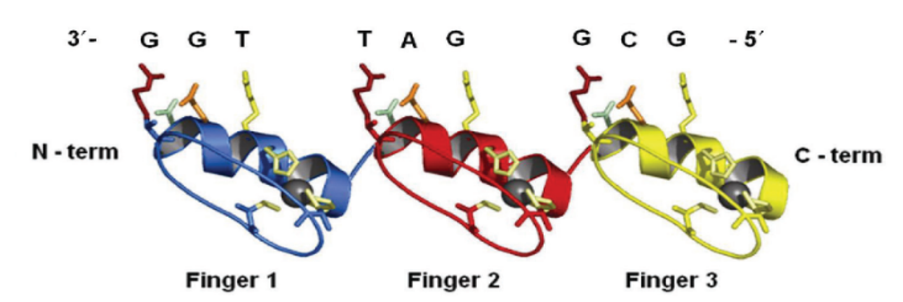
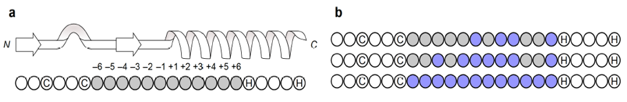

# PWMpredictor

# Introduction
Zinc finger (ZF) proteins are the largest class of human transcription factors with integral roles in genome regulation and function. Often using a subset of their ZFs domains, these proteins bind to diverse DNA triplets that make up the majority of the human regulatory code. 

Example of binding DNA ZFs:

One can identify a ZF  in a protein by the regular expression: CX[2,4]CX[12]HX[3,4,5]H, where C is the amino acid Cysteine, H is the amino acid Histidine and X represents any amino acid. The total length of a ZF is 12 and its positions are numbered as follows: [-6,-5,-4,-3,-2,-1,+1,+2,+3,+4,+5,+6].
Prior knowledge suggests that a subset of positions affect ZFs-DNA binding preferences. The common binding-affecting positions are the canonical [-1,2,3,6] or the extended [-4,-2,-1,+1,+2,+3,+6]. However, recent studies show that this assumption is not necessarily true, and all positions may influence DNA-binding preferences to some extent.

ZF identification and a highlight of the possible influence positions:

In this project, for a given protein ZF sequence, we predict its DNA triplet. The DNA preferences will be described by a position weight matrix (PWM). We used transfer learning to infer features from an in-vitro based model (trained on the B1H dataset) to predict binding preferences for an in-vivo dataset (the C-RC dataset).

# Pre-Requisite:
PWMpredictor require Python3.6

# Usage:
1. create saving folders:

	f="directoy name"

	mkdir -p $f
	
	mkdir -p ${f}/history
	
	mkdir -p ${f}/models
	
	mkdir -p ${f}/predictions
  
2. run model:

   python3.6 main_transfer_learning.py -d_add /data/ -add ${f} -lr 0.001 -e 50 -res_num 7 -m leave_one_out_model -r 1 -t_v retrain -ac_x False >> ${f}_out
   
   
   '-d_add', '--data_folder_address', help='main data and lables folder'
   
   '-add', '--folder_address', help='main folder address for savings'
   
   '-lr', '--learning_rate', help='learning rate of adam optimizer'
   
   '-e', '--epochs', help='number of epochs'
   
   '-res_num', '--residual_num', help='number of influence positions: 4 or 7'
   
   '-m', '--model_type', help='choose typeof model leave one out or cross validation'
   
   '-r', '--run_gpu', help='equal 1 if should run on gpu otherwise will run on cpu'
   
   '-t_v', '--transfer_version', help='fine tuning or retrain all layers'
   
   '-ac_x', '--amino_acid_x', help='use b1h data with amino acid x'
   

3. Model evaluation

   python3.6 eval_transfor_model.py -p update -gt_path update/ground_truth_c_rc.npy >> $out_eval
   
   '-p', '--predictions_add', help='predictions_path_address'
   
   '-gt_path', '--gt_path_res_num', help='ground truth of c_rc data set'
   

